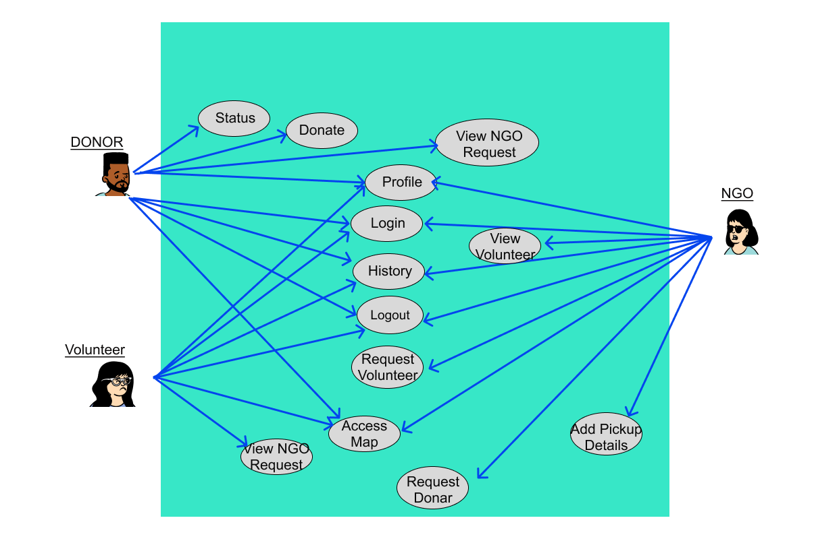
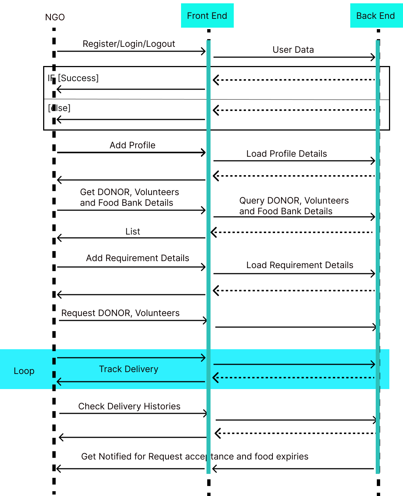
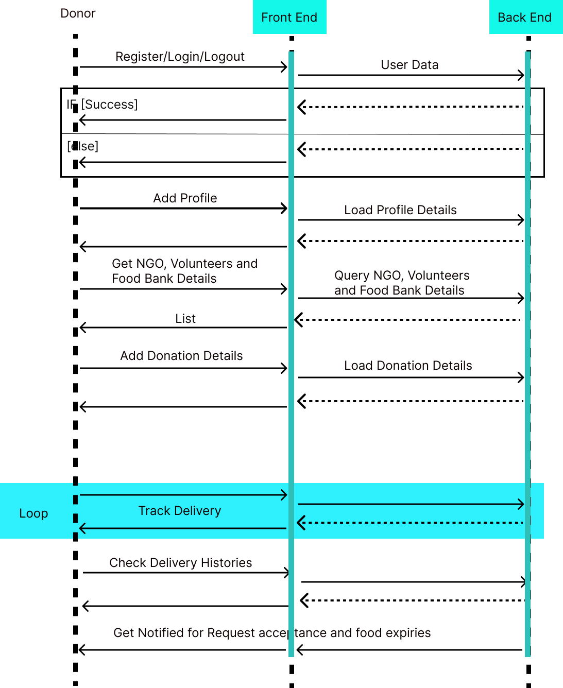
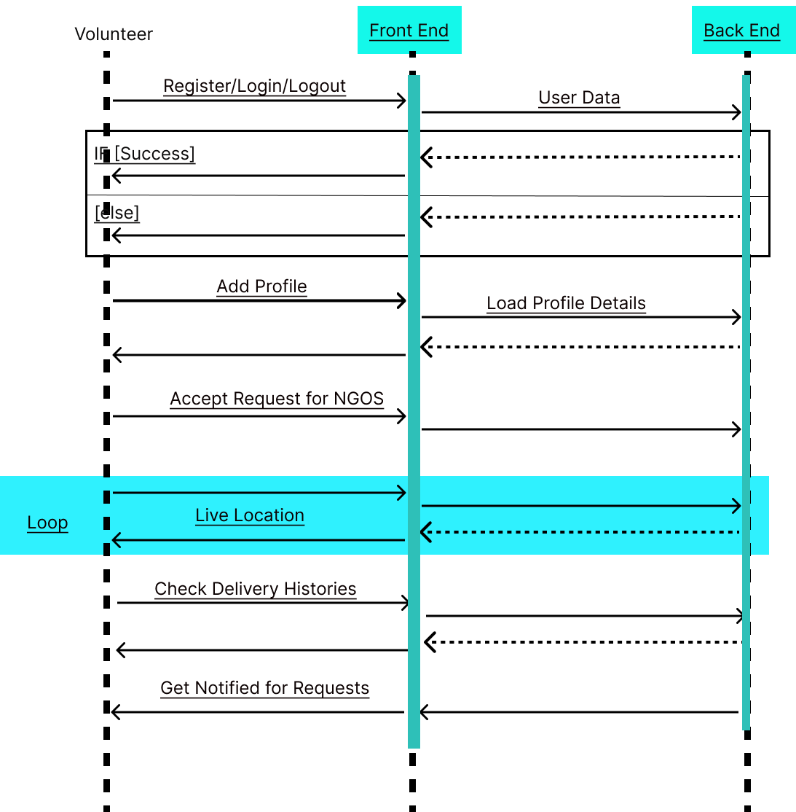

# Code-with-Google-Maps-2023 - Hack2skill

Welcome to the official repository for the Code-with-Google-Maps-2023 organized by Hack2skill!

#### Team Name - New Nourish
#### Problem Statement - 
#### Team Leader Email - nikhilkalburgi19@gmail.com

### A Brief of the Prototype:
Everyday, tonnes of food in urban cities is thrown away because they could not be consumed before expiry. Food wastage not only has a big impact on the environment, but also could have been better used to feed communities in need. So, we can create a platform that connects food suppliers with non-profit organisations. The platform makes use of Map API optimise food rescue routes, minimize transportation costs, and maximize benefits to communities in need. Instead of throwing away food that is close to expiry, we can organise rescue efforts for these food items so that they can be redistributed to those in need. Collection and redistribution logistics are key, and the app will optimize timing and route transport so as to minimize transport costs while ensuring food does not sit around and spoil while waiting to be re-distributed to those in need.	

In this platform has three entities,
1. DONOR - Adds a donation , accepts NGO requests and has the ability to track volunteer.
2. NGO - Request for the donation to donor , Request volunteer to deliver the donation and has the ability to track volunteer.
3. VOLUNTEER - Extract Donor or NGO information , Accept the request from volunteer , Get access to location points of donor or NGO to continue with the delivery.

#### USE CASE Diagram :

#### Sequence Diagram :
##### DONOR :
  
##### NGO :
  
##### VOLUNTEER :
    
### Tech Stack: 
   1. Front End - React Native with react-native-maps , react-native-geolocation-service , react-native-ui-kitten.
   2. Back End - Firebase through react-native-firebase 
   
### Step-by-Step Code Execution Instructions:
  1. Setup the environment for React-Native for windows as development system and android as target system following this https://reactnative.dev/docs/environment-setup?guide=native
  2. Clone this REPO and navigate to foodManagementApp folder
  3. Run the App on an Emulator or Physical Device:
        To run your app on an emulator or a physical device, you can use the following command. Make sure you have an Android or iOS emulator set up or a physical device connected following https://reactnative.dev/docs/environment-setup?guide=native .
     ```
     npx react-native run-android
     ```
  
### Future Scope:
   The future scope of a food management app includes sustainability and health features, personalization, IoT integration, food delivery, social interaction, AR/VR experiences, blockchain for food traceability, food waste reduction, restaurant and catering integration, international cuisine expansion, voice interaction, multi-platform support, data security, AI cooking assistants, and partnerships for growth and innovation. These developments will cater to changing consumer needs and technological advancements in the food industry.
