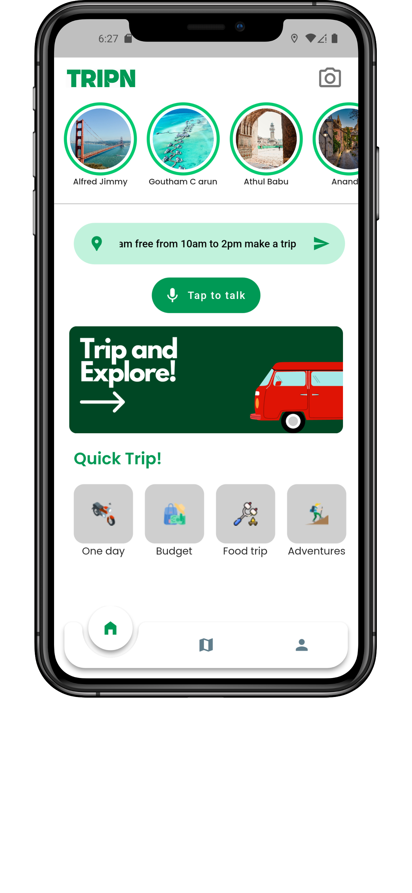
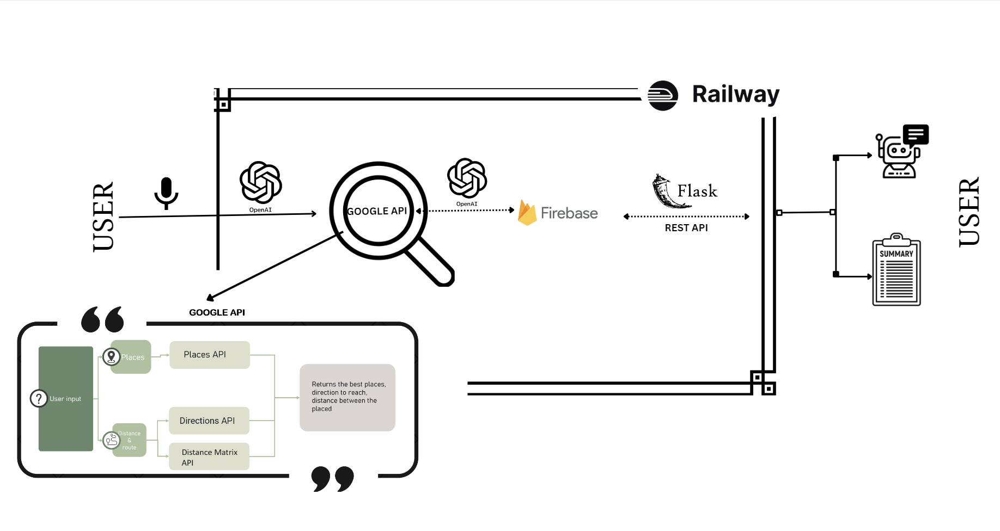
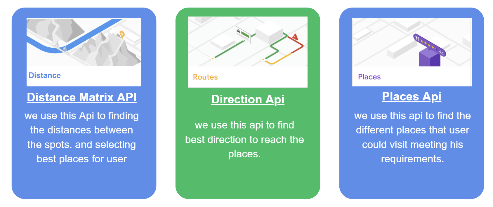
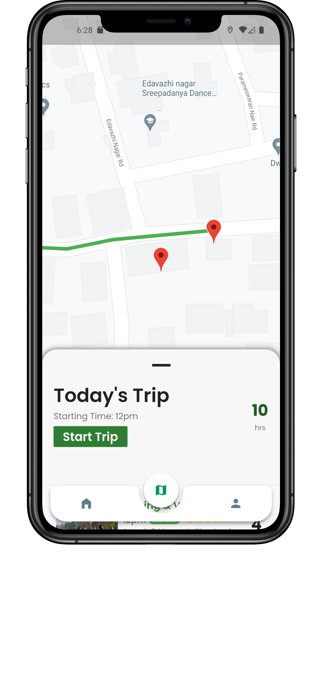
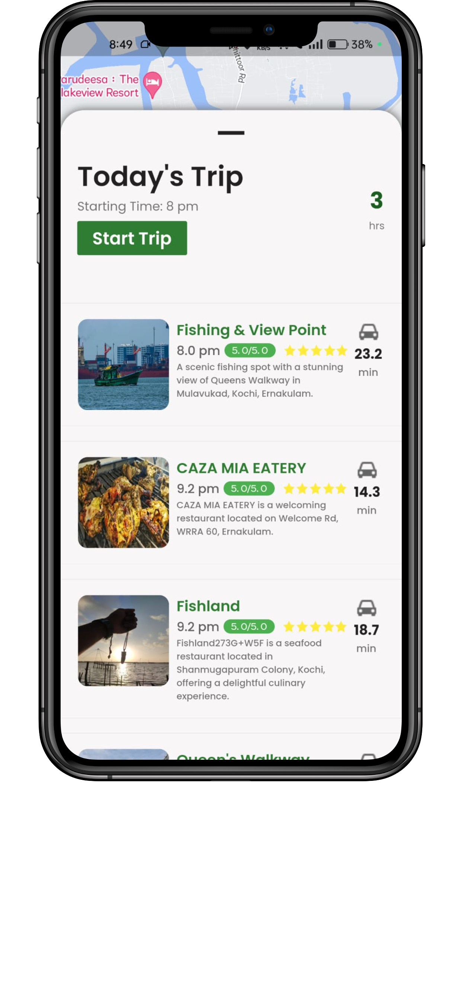

# TRIPN
<h1 align="center">
  <br>
  
  <br>
  TRIPN
  <br>
</h1>

<h3 align="center">Smart plan maker by the user choice!!</h3>


## About

This project was created for </Code> with Maps Hackathon

## Team Members:

- [Goutham C Arun](https://github.com/GouthamCArun)
- [Alfred Jimmy](https://github.com/alffy007)
- [Athul Babu](https://github.com/ATHULB04)

## Team Leader Email 

-gouthamchennamakkal@gamil.com

<p align="center">
  <a href="#problem-helpnow-solves">Problem Statement</a> •
   <a href="#solution">Solution</a> •
  <a href="#tech-stacks-used">Tech-Stacks used</a> •
  <a href="#backend-repo">Backend Repo</a> •

</p>
<div align="center">
  
</div>


## The Problem We Solve: Revolutionizing Work Efficiency and Collaboration, Byte by Byte.
"Planning outings is time-consuming, and people often face the challenge of choosing destinations and calculating travel times. We need an AI solution to recommend suitable places to visit based on a user's available time and preferences, simplifying planning and enabling users to maximize their leisure time."

## Solution
Our product will have the following features:

### 1. Plan trip base on user need

### 2. Different Rrestaurants and other services are shown in the plans. 

### 3.Include brief descriptions with each recommendation to give users more information about the suggested places, helping them make informed decisions.


An AI-driven service app for generates personalized trip plans, showcasing various restaurants and services, while also providing informative place descriptions for user convenience.

### Railway for Hosting
Furthermore, for hosting our project, we chose Railway. Railway is a cloud platform that simplifies the deployment and management of web applications. By utilizing Railway for hosting, we were able to easily deploy our project and make it accessible to users over the internet. Railway's user-friendly interface and seamless setup process allowed us to integrate our project with their platform effortlessly. With Railway, we benefit from reliable hosting infrastructure and automatic scaling, ensuring that our application can handle incoming traffic effectively. 

 <h3>This is How it works</h3>
     <br>
   </div>
      <div style="display:flex;" align="center">
    
    <br>
   <h3>Google APi Key Used/h3>
     <br>
    </div>
      <div style="display:flex;" align="center">
    
    <br>
   </div>
   <br>
    <h3>images of our app</h3>
   <div style="display:flex; gap:"5px";" align="center">
    
    
    
   </div>
# TECH STACKS USED

<h3> 
  1.flutter
  <br>
  2.ChatGPT with LangChain(for finding techstalks,summarising meetings)
  <br>
 4.Flask Rust API (Backend for API calls)
  <br>
 5.RAILWAY
  <br>

### Step-by-Step Code Execution Instructions:
## backend
1. Create a virtual environment:
    ```bash
    cd backend
    python -m venv env
    source env/Scripts/./Activate.ps1
    ```

2. Install the dependencies
    ```bash
   pip install -r requirements.txt

3. Start the development server:
    ```bash
   python main.py

4. Access the API in your browser at http://127.0.0.1:6000/text.
 ```bash
 example of past request:
    {"text":"i have no office today where can i go from 8am to 5 pm. i wanna chillll",
    "address":"Govt.Model Engineering College,Thrikakara",
    "latitude":"10.02817195",
    "longitude":"76.32843611331214"}  

