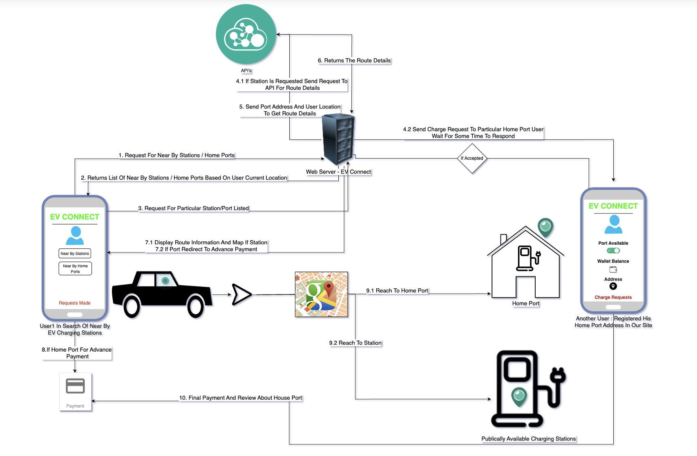
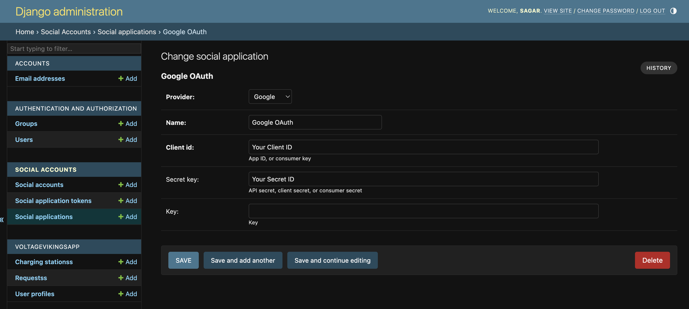

# Team Name - Voltage Vikings
# Problem Statement  
Inadequate EV charging infrastructure poses several critical challenges,
including increased pollution, hindrance to the growth of the EV industry,
adoption barriers for electric vehicles, urban stagnation, and high fuel costs.
# Team Leader Email 
sagar.dvg2002@gmail.com
# A Brief of the Prototype:
- Growing demand for Electric Vehicles (EVs due to pollution and fossil fuel depletion.
- Lack of charging stations threatens the EV industry's growth.
- Particularly challenging in tier-2 and tier-3 cities.
- Financial burden on citizens due to high fuel costs.
- Aims to address this global issue for a sustainable future.
Prototype Components:
  - Homepage: Clean design, location-based charging preferences.
  - Charging Station Search: Google Maps integration to locate charging stations.
  - Station Details: Comprehensive info and user-generated reviews.
  - Permission Request: For home-based stations, request to use facilities.
  - Payment Process: Secure payment gateway for public stations.
  - Route Planning: Efficient route guidance to selected charging station.
  - User Dashboard: Personalized management of requests and payments.
  - Administrator Panel: Oversight of user requests and system functionality.
- Process Flow
# Tech Stack
- Backend
  -  Python, Django Framework
- Frontend 
  - HTML
  - CSS
  - Javascript
- API's
  -  Google Maps(Routes,Directions,Maps Javascript), Razor Pay, Google OAuth Consent Screen
# Libraries and Dependencies
- Pychram/VS Code
- Google Map API Key
- Google OAuth API Key
- Razor Pay API Key
- Gmail App Password
- Required Module Are In The requiements.txt
# Step-by-Step Code Execution Instructions
- Clone The Repository And Activate venv (Since all the dependencies are pushed along with code to run the project smoothly)
- Just run the commands below
  - `source bin/activate` (Activate Your Virtual Environment)
  - `pip install -r requirements.txt`
  -  `python3 manage.py runserver`

-  Project Will Be Running At `localhost` Head On To Link http://127.0.0.1:8000/
  - To Access The Admin Account Head On To Link http://127.0.0.1:8000/admin And Login With username(`sagar`) and password(`2002`) Given While Creating Superuser
  - And Also Its Important To Ensure That The Social Application Provider Is Configured With The Neccessary Keys In The Admin Panel Just As Shown Below
    - 
- The Site Is Hosted Here - https://evconnects06.pythonanywhere.com/
# Future Scope
- **Integration** of this platform along with hardware interfacing in **EV's Infotainment Area**
- **Expanding Charging Station Network**: Continuously expand the database of charging stations to cover more regions, including rural areas and highways, to make EV adoption more convenient.

- **Mobile Applications**: To Develop mobile apps for iOS and Android platforms to make it even more accessible to users on the go.

- **Integration with More Payment Methods**: To Offer a variety of payment options to accommodate different user preferences.

- **Sustainability Initiatives**: To Incorporate features to promote sustainable energy use, such as integrating with renewable energy sources or providing incentives for eco-friendly practices.

- **Data Analytics**: To Implement data analytics to gather insights on user behavior and station usage to optimize the placement and availability of charging stations.

- **Smart Charging**: To Incorporate smart charging capabilities, allowing users to schedule and optimize charging times for cost efficiency and grid management.

- **User Community**: To Foster a community of EV enthusiasts to share tips, experiences, and encourage more people to switch to EVs.

- **Charging Station Ratings**: To Enhance the rating and review system to provide more detailed feedback and improve station quality.

- **Support for Multiple Languages**: To Make the platform accessible to a wider global audience by adding support for multiple languages.

- **Partnerships and Sponsorships**: To Collaborate with government bodies, EV manufacturers, and energy companies for sponsorship and support to expand the charging infrastructure.

- **Environmental Impact Tracking**: To Create a feature that allows users to track their environmental impact and emissions reduction by using EVs.

- **Regulatory Compliance**: To Stay updated with EV regulations and ensure the platform complies with them.

- **Cybersecurity**: Strengthen cybersecurity measures to protect user data and financial transactions.

- **EV Marketplace**: Integrate an EV marketplace where users can buy, sell, or trade electric vehicles and related accessories.

- **Integration with Public Transit**: Collaborate with public transportation systems to provide seamless multimodal transportation solutions.

