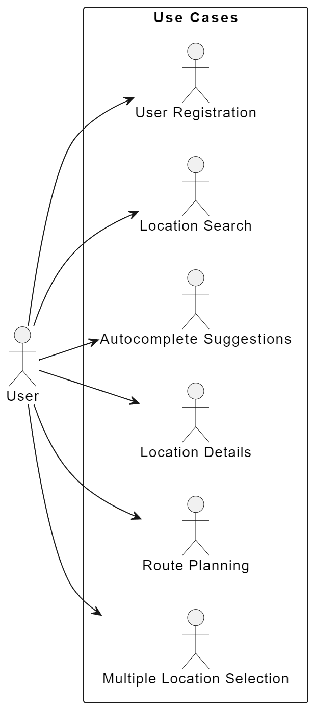

#### Team Name - Code Mapathon

#### Problem Statement - "Unlocking the Full Potential of Location-Based Experiences: Bridging Gaps, Streamlining Interactions, and Enhancing User Security"

#### Team Leader Email - <sitammeur@gmail.com>

### A Brief of the Prototype

Our project is a Django-powered application that harnesses the power of Google's APIs, including reCAPTCHA, Maps, and others, to deliver a dynamic and secure location-based experience. Focusing on elevating the functionality and security of location-based applications, our solution caters to diverse industries and user needs. By seamlessly integrating these Google APIs, we aim to enhance user interactions with maps and location data while safeguarding against spam and unauthorized access. Whether it's finding optimal routes, discovering nearby points of interest, or ensuring secure user interactions with robust reCAPTCHA verification, our application redefines how users engage with location-based services within the trusted Google ecosystem.

UML Diagram of our project is as follows:

### Tech Stack

- _Backend Framework -_ Django
- _Frontend Technologies -_ HTML, CSS, JavaScript
- _API Integration -_ Google Maps APIs (Places API, Geocoding API, Maps JavaScript API, Directions API, Distance Matrix API)
- _Authentication and Authorization -_ Django Built-in User Authentication System
- _Database Management -_ SQLite Database Management System (Django ORM) for Development, PostgreSQL For Production ('Cloud SQL' from Google Cloud Platform)
- _Cloud Platform -_ Google Cloud Platform

In the prototype stage, some aspects like machine learning features are yet to be fully implemented, but our tech stack forms the foundation for future enhancements in these areas.

### Step-by-Step Code Execution Instructions

    Prerequisites:
        You must have Python 3.8 or higher installed on your system.
        You must have Git installed on your system.
        You must have a Google Cloud Platform account.
        You must have a Google Maps API key.
        You must have a Google reCAPTCHA API key. Make sure to create .env file in the root codewithmaps-main directory and add your api keys in the following format:

        SECRET_KEY=django-insecure-3ixlqu6t@*1kq6h+g8%!g0vsrx#%7yl1yj&445@ipo%p#fa!y0
        DEBUG=True

        GOOGLE_API_KEY=YOUR_GOOGLE_API_KEY
        RECAPTCHA_PUBLIC_KEY=YOUR_RECAPTCHA_PUBLIC_KEY
        RECAPTCHA_PRIVATE_KEY=YOUR_RECAPTCHA_PRIVATE_KEY

    Now follow these steps to run the application:
      1. Clone the repository using the following command:

      `git clone https://github.com/sitamgithub-MSIT/codewithmaps.git`

      2. Cd into the directory using the following command:

        `cd code_mapathon`

        3. Create a virtual environment using the following command:

        `python -m venv venv`

        4. Activate the virtual environment using the following command:

        `venv\Scripts\activate`

        5. Cd into the directory using the following command:

        `cd codewithmaps-main`

        6. Install the requirements using the following command:

        `pip install -r requirements.txt`

        7. Run the server using the following command:

        `python manage.py runserver`

        8. Open the browser and go to the following link:

        `http://localhost:8000/`

        9. Now you can use the application. Enjoy!

### Future Scope

For future development, we can add more features like:

- _Scalability -_ To accommodate mid-growing user demand, we'll optimize backend services and enhance scalability by deploying the Django web application on Google Cloud Run. This fully managed container platform enables automatic scaling based on traffic, coupled with Google Cloud SQL for data reliability and managed database maintenance.

- _AI and Machine Learning -_ Future iterations will introduce advanced machine learning algorithms to offer highly personalized recommendations and improve user experiences. This includes recommendation engines, natural language processing, and predictive analytics, enhancing the application's ability to suggest nearby locations and optimized routes based on user preferences and historical data.

- _Internationalization -_ We plan to expand language support to cater to a global user base. Django's built-in internationalization features can be leveraged to support multiple languages. Additionally, users can select their base country, aligning search results with their preferences and prioritizing locations relevant to that country.

- _Areial View -_ We can add the feature of an aerial view of the map. This feature can be implemented using the Google Maps Aerial View API, recently launched by Google. It allows users to switch to an aerial view, providing a different perspective on the map. Note that this feature is dependent on the availability of aerial imagery.
