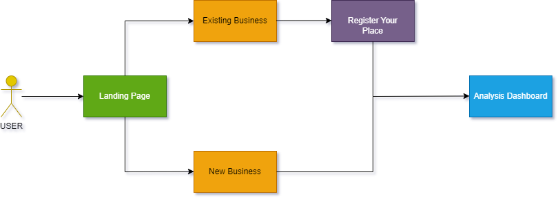

# Code-with-Google-Maps-2023 - Hack2skill

Welcome to the official repository for the Code-with-Google-Maps-2023 organized by Hack2skill!

## Getting Started

To get started with the Code-with-Google-Maps-2023 repository, follow these steps:

### Submission Instruction:
  1. Fork this repository
  2. Create a folder with your Team Name
  3. Upload all the code and necessary files in the created folder
  4. Upload a **README.md** file in your folder with the below mentioned informations.
  5. Generate a Pull Request with your Team Name. (Example: submission-XYZ_team)

### README.md must consist of the following information:

#### Team Name - Site Strategist​

#### Problem Statement - We help empowering businesses to choose the perfect location/area for establishing the business with data-driven insights on competition, resources, and optimization, ensuring confident decision-making.

#### Team Leader Email - aditya_sawant@persistent.com

### A Brief of the Prototype:
  This section must include UML Diagrams and prototype description
  UML Digram :
  We have added an UML digram image to the Site Strategist folder.
  

  Prototype Description :
  When businesses need to make decisions about their business location, it becomes difficult to assess the suitability of that location.
  So here we come up with the solution: SiteStrategist.
  Our goal is to provide businesses with data-driven insights on competition, resources and optimization to help them choose the best location/area to start their business and make decisions with confidence.
  Our solutions leverage the power of various Google Maps APIs to provide comprehensive data-driven insights into market competition, resource access, and location optimization. These insights come from Google Maps' many features and data sources, including business listings, detailed location information, circular boundaries and area level boundaries.
  The solution displays the number of competitors by clustering and providing markers. Our goal is to introduce this solution to the B2B market and provide consulting services to companies of all sizes who want to start their business or expand business.
  This platform is going to be targeted by 2 types of people, A business person with an existing business like many branches. Another will be a person who is looking to do a startup.

  
### Tech Stack: 
   List Down all technologies used to Build the prototype
   - HTML
   - CSS
   - JavaScript
   - Maps Api
   
### Step-by-Step Code Execution Instructions:
  This Section must contain a set of instructions required to clone and run the prototype so that it can be tested and deeply analyzed
  1. Load home.html page on browser for landing page
  2. If you click on New Bussiness you will be redirected to analysis page.
		
	 If you click on Existing Business button you will redirected to register place page
		- Enter Place Name,Latitude,Longitude and click add. Like this you can add multiple places for analysis.
		- After adding place detials you can click analyse
  3. once you landed at analysis page you can select desired place/location for analysis by autosuggestion text box 'Enter a 	Place'.
  
  4. You can do analysis of POI by clicking on diffrent predefined Icons(Bank,ATM, etc.)
  5. You can also do analysis of POI by any custom keyword by clicking 'Not in List?' button
		-It will open text box to search by any keyword.

	FOR MORE FUNCTIONALITIES YOU CAN CHECK DEMO VIDEO.
  
### Future Scope:
	
   Write about the scalability and futuristic aspects of the prototype developed
   
   Route & distance between selected points: We are planning to show route and along with this its distance and duration between two selected points​
​
  Real-time traffic data : We can integrate Real time traffic data which will provide live information about current road condition and congestion.​
  ​
  Clustering of Markers : We are planning to integrate marker clustering User will able to see area wise markers count.​
  ​
  Heatmap analysis and geocoding services: We can integrate heatmap layer visualization on the user interface and  also want to give flexibility to the user to add latitude and longitude coordinates or address as per they want.​
  ​
  3d map view :We have plan to integrate 3d map view This will enhances the visual representation​
  ​
  Dynamic Radius: In the existing prototype we are giving 5 km static radius to search around in future scope we are planning to enter this radius manually as per the user want to search ​
  ​
  Store the searched location: User can store the records of searched combination of nearby competitors. ​
​
​
​
​
​
​
​
​
